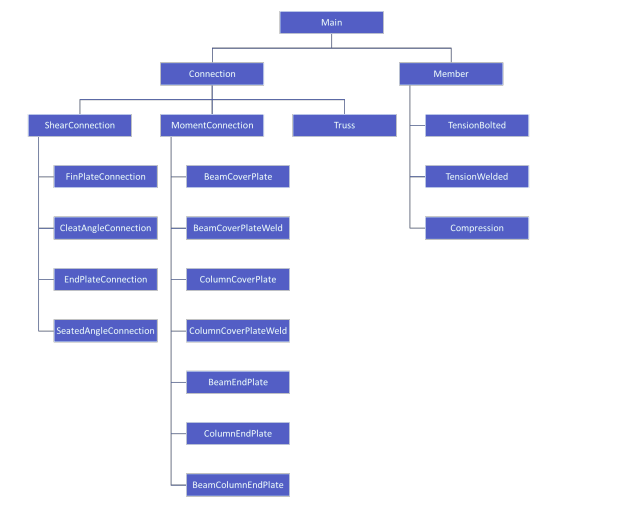

# FOSSEE-Sumer-Fellowship-2023-Report

### Day 1 [17-05-2023]

On this day we had meeting with Rutvik Joshi and Danish Ansari at 6:00 pm.
In this meeting I first create a virtual machine with ubuntu 20.04 LTS and and install osdag installer from osdag website and successfully ran osdag software. while running the software I encountered different errors and fixed them with my mentors.
Also fork and clone osdag repository to my local computer and configured it with PyCharm editor and set up `miniconda3/bin/python3.7` as a interpreter.

### Day 2 [18-05-2023]

On this day I read all the [documents](https://drive.google.com/drive/folders/1H3WVOoegyfATZ-HNCgjrJ3VXI1zjh5sd) that related to Osdag software. Tried to understand `Hierarchy of Modules` , How to add new modules, what is `Input Dock` and `Output Dock` in modules.   

### Day 3 [19-05-2023]

On this day I revised my python basics, learned OOPS in python and also learned about PyQt5.

### Day 4 & 5 [20-05-2023 & 21-05-2023]

Tried to understand code base.
